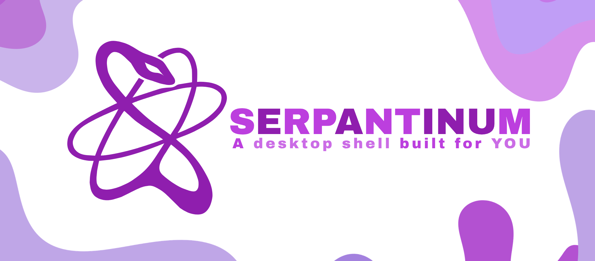

# yoake

A Wayland shell, forked from [ilyamiro/serpantinum](https://github.com/ilyamiro/serpantinum)
and renamed. Fedora and niri, where upstream targets Arch and leads with Hyprland.

It is a fork rather than a configuration because the parts being added do not
fit through a config file: upstream has no plugin system, so a new bar module,
widget or panel means editing `bar/TopBar.qml`, `widgets/WidgetRegistry.qml` or
`WindowRegistry.js`. Changes here are therefore kept narrow and separable —
everything of ours that can live in `src/quickshell/yoake/` does — so this can
be rebased onto an upstream that has already rewritten its history once.

**Running it on Fedora: [docs/fedora.md](docs/fedora.md).** Upstream's installer
refuses to run on anything outside the Arch family; this one also installs on
Fedora and its derivatives (`bash install/install.sh --yes`).

## Taking upstream's updates

`tools/sync-upstream.sh`. Upstream cannot be merged directly: the fork is
renamed throughout, so every line upstream touches also differs from ours by
the name, and the merge to 2.0.4 produced sixteen conflicts that were almost
all empty.

So a branch sits between us and upstream. `upstream-renamed` holds upstream's
tree with `tools/rename-upstream.py` already applied and nothing of ours in it.
Merging that branch compares renamed against renamed, and what conflicts is
only what we and upstream both changed in substance.

Its commits are deliberately single-parent. Making them merges with upstream
would put upstream's raw commits into our ancestry, the next merge base would
move back to an unrenamed tree, and the conflicts would return.

The merge is rehearsed in a throwaway worktree first. The checkout here is a
running shell — quickshell watches these files and reloads them by itself —
and it must never see QML with conflict markers in it. On conflict the script
stops and leaves the working copy untouched; on success it fast-forwards.

Running it from the About tab's Update button does the same thing.

## What is ours

| | |
|---|---|
| `src/quickshell/yoake/` | the layer: everything added rather than modified |
| `src/scripts/wallpaper-palette.py` | the palette, measured off the wallpaper in OKLCh |
| `docs/fedora.md` | how this actually gets installed and run here |
| `tools/` | how upstream's updates get in, renamed on the way |

Colours are not a preset. The wallpaper's dominant hue is measured as a
chroma-weighted circular mean in OKLCh and the accent is synthesized on it,
with the measured chroma carried along as a confidence value — so a
near-monochrome image yields a genuinely muted accent instead of an invented
one. `YoakePalette` derives upstream's twenty-two named colours from that and
hands them to `ThemeBackend`, which every widget already reads, so the whole
shell re-themes with the wallpaper and fades rather than snaps.

Set `theme.yoake` to `false` in `~/.config/yoake/settings.json` to stand the
layer down and see the base shell unaltered.

## License

AGPL-3.0-or-later, as upstream.

Copyright (C) 2026 Illia Miroshnichenko, for serpantinum, which this is derived from.

Copyright (C) 2026 yorushi, for modifications made in this fork.

---

> [!NOTE]
> **Everything below is upstream's own documentation**, kept as it was. It
> describes upstream's installer, upstream's package name and upstream's paths,
> none of which apply to this fork — see [docs/fedora.md](docs/fedora.md)
> instead. It is left here because it still documents the shell's own settings
> and Nix modules accurately.


<div align="center">
  <a href="https://ko-fi.com/ilyamiro">
    
  </a>
</div>

<div align="center">
  
</div>

## Previews

| | |
|---|---|
|  |  |
|  |  |

---

## Installation

> [!IMPORTANT]
> **Migrating from v1:** All previous configuration will be backed up and unused. Configuration of compositor settings such as monitors, keybinds, and autostart is now up to you, as the project migrated from being dotfiles to being a shell.

### Arch Linux and its derivatives

For Arch-based distributions (including systemd, OpenRC, and other init systems), run the automated installation script.:

```bash
bash -c "$(curl -fsSL https://raw.githubusercontent.com/ilyamiro/serpantinum/master/install/install.sh)"
```

> [!NOTE]
> To update, when or if you recieve a notification about the new version being available, just run the script again and choose "update"

---

### NixOS

Yoake provides flake outputs, a NixOS module for system dependencies, and a Home Manager module for user configuration and service management.

#### 1. Add Flake Input

Add Yoake to your `flake.nix`:

```nix
{
  inputs = {
    nixpkgs.url = "github:nixos/nixpkgs/nixos-unstable";
    yoake.url = "github:ilyamiro/serpantinum";
  };

  outputs = { self, nixpkgs, yoake, ... }: {
    nixosConfigurations.nixos = nixpkgs.lib.nixosSystem {
      system = "x86_64-linux";
      specialArgs = { inherit yoake; };
      modules = [
        ./configuration.nix
        yoake.nixosModules.default
      ];
    };
  };
}

```

#### 2. configuration.nix

Enable the NixOS module to configure system prerequisites:

```nix
{
  programs.yoake.enable = true;
}

```

If you prefer installing the package directly without the system module:

```nix
{ pkgs, yoake, ... }:

{
  environment.systemPackages = [
    yoake.packages.${pkgs.stdenv.hostPlatform.system}.default
  ];
}

```

#### 3. Home Manager Configuration

```nix
{ yoake, ... }:

{
  imports = [
    yoake.homeManagerModules.default
  ];

  programs.yoake = {
    enable = true;
    systemd.enable = true;

    settings = {
      wallpaperDir = "/home/username/Pictures/Wallpapers";

      general = {
        language = "en";
        weatherUnit = "metric";
        weatherInterval = 30;
      };

      bar = {
        position = "top";
        style = "solid";
        width = 40;
        workspaceCount = 10;
        modules = {
          left = [ "workspaces" ];
          center = [ "time" ];
          right = [ "tray" [ "kb" "wifi" "bt" "vol" "bat" ] ];
        };
      };

      theme = {
        fontFamily = "Adwaita Mono";
        borderRadius = 12;
        matugen = true;
      };

      notifications = {
        dnd = false;
        position = "top right";
        sound = true;
      };
    };
  };
}

```

> **Note:** The automatic installer handles compositor integration on standard distributions. On NixOS / Home Manager, you must manually integrate compositor configs.
> Sample configs, autostart entries, and keybindings for supported window managers and compositors are available in the [compositors](https://github.com/ilyamiro/serpantinum/tree/master/compositors) directory.

Ensure your compositor config launches the daemon or shell binary on startup:

```bash
yoaked start

```

## Credits

- Special thanks to Darkall44/Qylock for providing a gorgeous material SDDM theme!

---

## License

Copyright (C) 2026 Illia Miroshnichenko

This project is licensed under the GNU Affero General Public License version 3, or (at your option) any later version. See the [LICENSE.md](LICENSE.md) file for the full license text.
