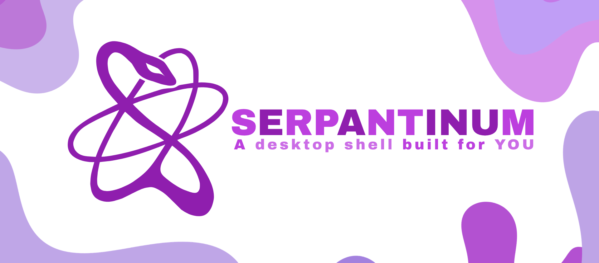

<div align="center">
  <a href="https://ko-fi.com/ilyamiro">
    
  </a>
</div>

<div align="center">
  
</div>

## Previews

| | |
|---|---|
|  |  |
|  |  |

---

## Installation

> [!IMPORTANT]
> **Migrating from v1:** All previous configuration will be backed up and unused. Configuration of compositor settings such as monitors, keybinds, and autostart is now up to you, as the project migrated from being dotfiles to being a shell.

### Arch Linux and its derivatives

For Arch-based distributions (including systemd, OpenRC, and other init systems), run the automated installation script.:

```bash
bash -c "$(curl -fsSL https://raw.githubusercontent.com/ilyamiro/serpantinum/master/install/install.sh)"

```

> [!NOTE]
> To update, when or if you recieve a notification about the new version being available, just run the script again and choose "update"

---

### NixOS

Serpantinum provides flake outputs, a NixOS module for system dependencies, and a Home Manager module for user configuration and service management.

#### 1. Add Flake Input

Add Serpantinum to your `flake.nix`:

```nix
{
  inputs = {
    nixpkgs.url = "github:nixos/nixpkgs/nixos-unstable";
    serpantinum.url = "github:ilyamiro/serpantinum";
  };

  outputs = { self, nixpkgs, serpantinum, ... }: {
    nixosConfigurations.nixos = nixpkgs.lib.nixosSystem {
      system = "x86_64-linux";
      specialArgs = { inherit serpantinum; };
      modules = [
        ./configuration.nix
        serpantinum.nixosModules.default
      ];
    };
  };
}

```

#### 2. configuration.nix

Enable the NixOS module to configure system prerequisites:

```nix
{
  programs.serpantinum.enable = true;
}

```

If you prefer installing the package directly without the system module:

```nix
{ pkgs, serpantinum, ... }:

{
  environment.systemPackages = [
    serpantinum.packages.${pkgs.stdenv.hostPlatform.system}.default
  ];
}

```

#### 3. Home Manager Configuration

```nix
{ serpantinum, ... }:

{
  imports = [
    serpantinum.homeManagerModules.default
  ];

  programs.serpantinum = {
    enable = true;
    systemd.enable = true;

    settings = {
      wallpaperDir = "/home/username/Pictures/Wallpapers";

      general = {
        language = "en";
        weatherUnit = "metric";
        weatherInterval = 30;
      };

      bar = {
        position = "top";
        style = "solid";
        width = 40;
        workspaceCount = 10;
        modules = {
          left = [ "workspaces" ];
          center = [ "time" ];
          right = [ "tray" [ "kb" "wifi" "bt" "vol" "bat" ] ];
        };
      };

      theme = {
        fontFamily = "Adwaita Mono";
        borderRadius = 12;
        matugen = true;
      };

      notifications = {
        dnd = false;
        position = "top right";
        sound = true;
      };
    };
  };
}

```

#### 4. Updating

Update the flake lockfile and rebuild your system:

```bash
nix flake update serpantinum
sudo nixos-rebuild switch --flake .

```

> **Note:** The automatic installer handles compositor integration on standard distributions. On NixOS / Home Manager, you must manually integrate compositor configs.
> Sample configs, autostart entries, and keybindings for supported window managers and compositors are available in the [compositors](https://github.com/ilyamiro/serpantinum/tree/master/compositors) directory.


#### Required autostart

Remember to add clipboard listeners and required services to your compositor's autostart configuration for the clipboard and the equalizer to work properly.

Example on Hyprland:

```lua
hl.on("hyprland.start", function()
  hl.exec_cmd("wl-paste --type text --watch cliphist store")
  hl.exec_cmd("wl-paste --type image --watch cliphist store")
  hl.exec_cmd("systemctl --user enable --now easyeffects")
end)

```
---

## Running

To run the shell, launch `serpantinumd start`

---

## Credits

* Special thanks to Darkall44/Qylock for providing a gorgeous material SDDM theme!

<br><br><br>

<div align="center">
  <h3>Thanks to all contributors</h3>
  <br>

  <a href="https://github.com/TheRinder2"></a>
  <a href="https://github.com/bizneskind-droid"></a>
  <a href="https://github.com/Pigeon78"></a>
  <a href="https://github.com/Eduarduar"></a>
  <a href="https://github.com/Spinty-dev"></a>
  <a href="https://github.com/MrDexstor"></a>
  <a href="https://github.com/coloramamoe"></a>
  <a href="https://github.com/Zyxilon"></a>
  <a href="https://github.com/gouthamkrishnap"></a>
  <a href="https://github.com/Stoltembergg"></a>
  <a href="https://github.com/andckadir"></a>
  <a href="https://github.com/ArseniiTkachuk"></a>
  <a href="https://github.com/MCUxDaredevil"></a>
  <a href="https://github.com/MILKv2"></a>
  <a href="https://github.com/pedrolourencosilva"></a>
  <a href="https://github.com/Vaspyyy"></a>
  <a href="https://github.com/Sergi122"></a>
  <a href="https://github.com/Syrup5845"></a>
  <a href="https://github.com/forteleaf"></a>
  <a href="https://github.com/kranks-uga"></a>
  <a href="https://github.com/zynx-real"></a>
</div>

<br><br>

---

## License

Copyright (C) 2026 Illia Miroshnichenko

This project is licensed under the GNU Affero General Public License version 3, or (at your option) any later version. See the [LICENSE.md](LICENSE.md) file for the full license text.

